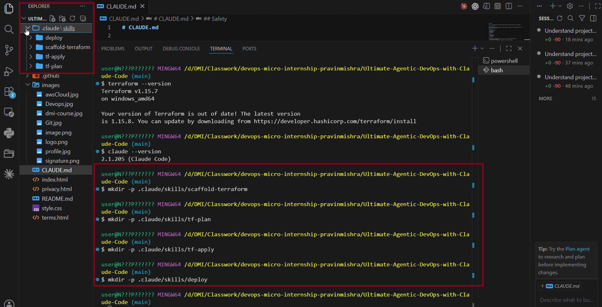
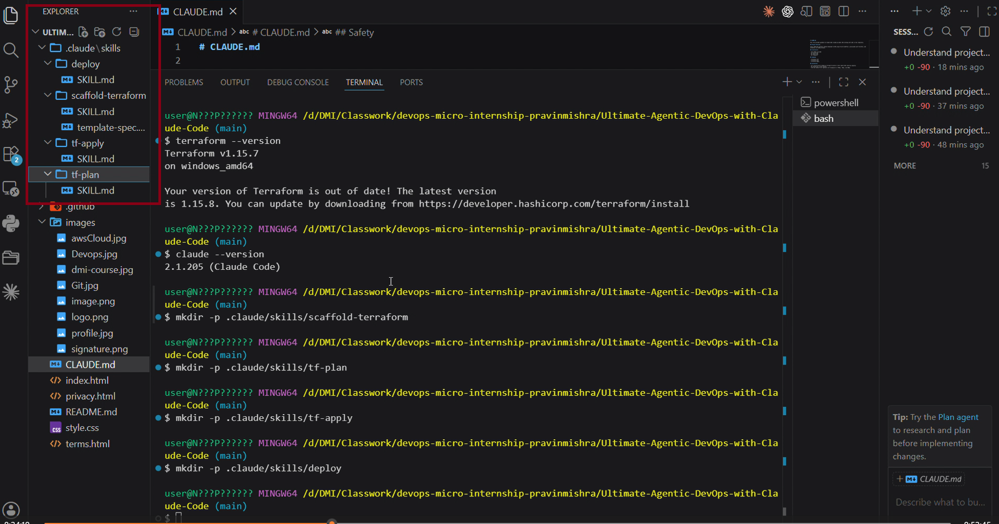
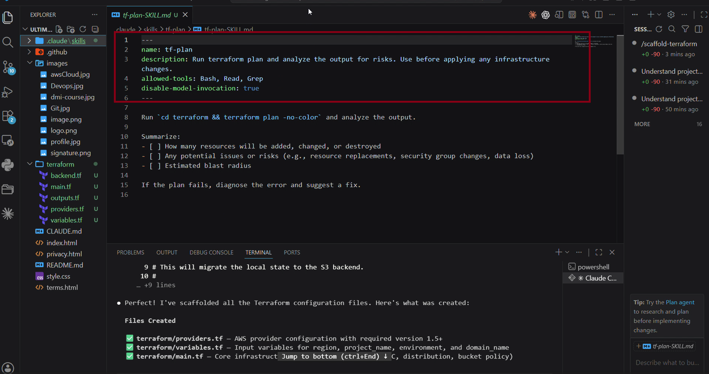
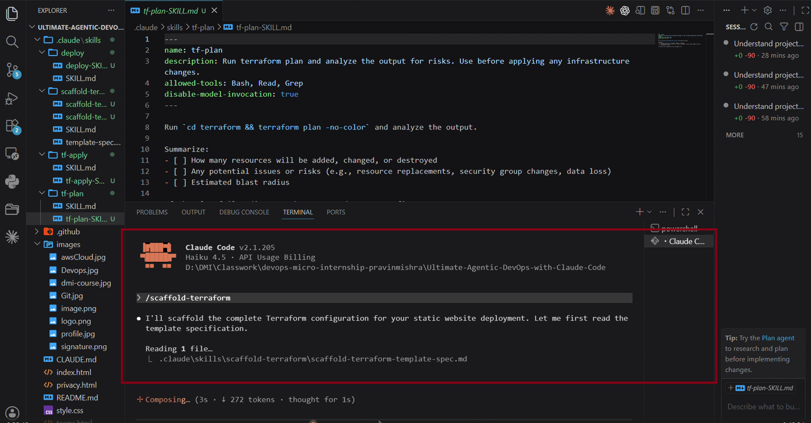
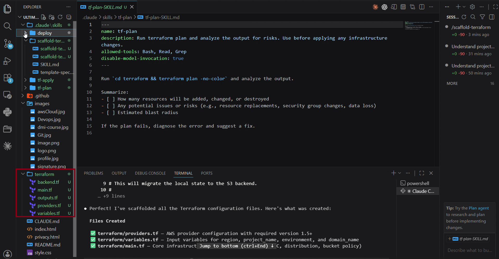
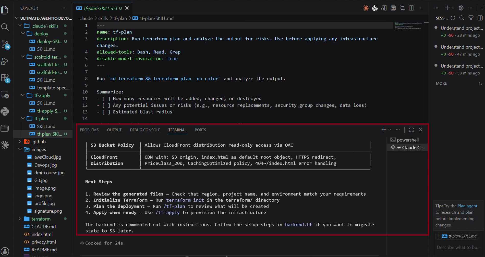

# Assignment 3 — Building Your Command Center

Part of the DevOps Micro Internship (DMI) Cohort 3 with Agentic AI

---

## Purpose

In this assignment, you will build a local Claude Skills system by creating the `.claude/skills/` folder structure, adding predefined skill files, and executing a real agentic command (`/scaffold-terraform`) to generate infrastructure code. You will also observe how skills enforce tool restrictions and enable controlled automation.

---

# Task 1 — Create the Skill Folder Structure

## Goal

Create the required `.claude/skills/` directory structure for all skills.

### Evidence

#### Screenshot 1 — VS Code sidebar showing `.claude/skills/` folder with all 4 subfolders visible

---

# Task 2 — Add the Skill Files

## Goal

Place all required skill files into their correct directories and verify their configuration.

### Evidence

#### Screenshot 2 — `.claude/skills/scaffold-terraform/` open in VS Code showing both `SKILL.md` and `template-spec.md`

---

#### Screenshot 3 — Screenshot 3 — `tf-plan/SKILL.md` frontmatter showing `allowed-tools: Bash, Read, Grep` (no Write) and `disable-model-invocation: true`

---

# Task 3 — Run /scaffold-terraform

## Goal

Execute the `/scaffold-terraform` skill to generate a full Terraform infrastructure setup.

### Evidence

#### Screenshot 4 — Claude's response showing the scaffold complete with the file list

---

#### Screenshot 5 — VS Code sidebar showing the `terraform/` folder with all generated files inside

---

# Task 4 — Run terraform init and /tf-plan

## Goal

Initialize Terraform and execute the `/tf-plan` skill to observe plan execution and output analysis.

### Evidence

#### Screenshot 6 — Claude's `/tf-plan` response showing it ran the command and analyzed the result (pass or auth error both count)

---

# Submission Instructions

- Ensure `.claude/skills/` folder and all skill files are committed to your GitHub repository
- Run all commands successfully and capture required screenshots
- Push final changes to your forked repository

---

## GitHub Repository URL

Paste your forked repository URL here:

`https://github.com/nehapatel81/Ultimate-Agentic-DevOps-with-Claude-Code`
======

## LinkedIn post URL

Paste your forked repository URL here:

`https://www.linkedin.com/posts/workwithneha_join-the-dmi-devops-micro-internship-share-7481444364150284290-vk51/?utm_source=share&utm_medium=member_desktop&rcm=ACoAADVmLRoB9dJ70xtJ1M6sDVbSBOiVTmQDql0`
======
---

# Completion Checklist

- [x] `.claude/skills/` folder created with all 4 skill folders
- [x] All skill files placed correctly
- [x] `tf-plan/SKILL.md` shows correct `allowed-tools` restrictions
- [x] `/scaffold-terraform` executed successfully
- [x] Terraform files generated inside `terraform/` folder
- [x] `terraform init` executed successfully
- [x] `/tf-plan` executed and output analyzed by Claude
- [x] All required screenshots added
- [x] GitHub repository URL included
- [x] LinkedIn post URL included

---

## 📌 About DMI & CloudAdvisory

DevOps Micro Internship (DMI) is a project-based DevOps program run by Pravin Mishra (The CloudAdvisory) focused on real-world execution, systems thinking, and career readiness.

It helps learners build strong DevOps foundations with hands-on experience.

---

## 📌 Resources

- 🌐 DMI Official Website: https://pravinmishra.com/dmi  
- 🎓 DevOps for Beginners (Udemy): https://www.udemy.com/course/devops-for-beginners-docker-k8s-cloud-cicd-4-projects/  
- 🎓 Agentic AI DevOps with Claude Code: https://www.udemy.com/course/ultimate-agentic-ai-devops-with-claude-code/  
- 🎓 DevOps with Claude Code: Terraform, EKS, ArgoCD & Helm: https://www.udemy.com/course/devops-with-claude-code-terraform-eks-argocd-helm/  
- ▶️ YouTube Playlist: https://www.youtube.com/playlist?list=PLFeSNDtI4Cho  
- 🔗 Pravin Mishra (LinkedIn): https://www.linkedin.com/in/pravin-mishra-aws-trainer/  
- 🏢 CloudAdvisory (LinkedIn): https://www.linkedin.com/company/thecloudadvisory/

---

*This submission is part of DevOps Micro Internship (DMI) Cohort 3 — Agentic AI Track.*