# Assignment 5 — Bash Script Automation Drill (OPS Checklist)

Part of the DevOps Micro Internship (DMI) Cohort 3 with Agentic AI

---

## Purpose

In this assignment, you will practice Bash scripting by building a series of small automation scripts covering environment setup, variables, arrays, loops, file conditionals, if-else logic, and functions. These scripts form the foundation of real-world Linux automation used in DevOps, cloud, and production support environments.

---

# Task 1 — Bash Environment & Workspace Setup

## Goal

Verify that Bash is available on your system and create a clean workspace for this assignment.

### Evidence

#### Screenshot 1 — Output of `echo $SHELL` and `bash --version`

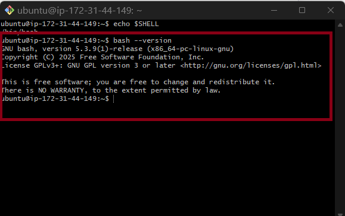

---

#### Screenshot 2 — Output of `pwd` and `ls -lah` showing the scripts directory

---

### Notes

Answer the following in your own words:

**1. What is Bash?**

Bash is a command-line interpreter that allows users to interact with the Linux operating system.It lets us run commands, create scripts, and automate repetitive tasks.This makes system administration faster and more efficient.

---

**2. What is the difference between shell and Bash?**

A shell is a program that allows users to communicate with the operating system.Bash is one type of shell and is the most commonly used shell on Linux.It provides additional features for scripting and automation.

---

**3. Why is it important to confirm the Bash version before writing scripts?**

Checking the Bash version ensures that the script uses supported features.
Different Bash versions may have different capabilities and behaviors.This helps prevent compatibility issues and unexpected errors when running scripts.

---

# Task 2 — Your First Bash Script

## Goal

Create your first Bash script, make it executable, and run it from the terminal.

### Evidence

#### Screenshot 1 — Content of `first-script.sh`

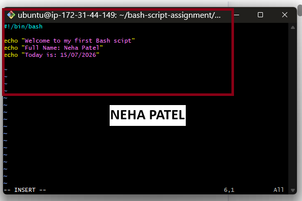

---

#### Screenshot 2 — Output of `./first-script.sh`

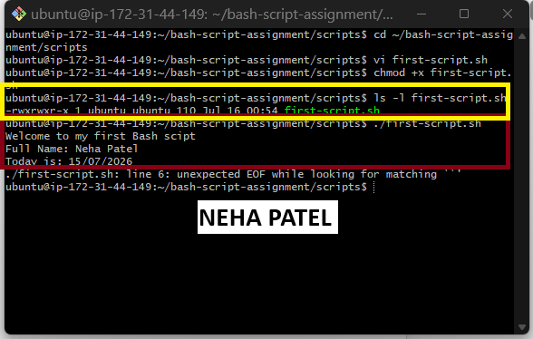

---

#### Screenshot 3 — Output of `ls -l first-script.sh` showing executable permission

---

### Notes

Answer the following in your own words:

**1. What is the purpose of `#!/bin/bash`?**

The #!/bin/bash line tells the system to execute the script using the Bash interpreter.It ensures the script runs with Bash, even if another shell is the default.This helps the script behave as expected.

---

**2. Why do we use `chmod +x` before running a script?**

The chmod +x command makes the script executable. Without execute permission, the script cannot be run directly.It allows the script to be executed using ./script.sh.

---

**3. What is the difference between running a script using `./script.sh` and `bash script.sh`?**

./script.sh runs the script as an executable file and requires execute permission.bash script.sh runs the script using the Bash interpreter directly.It works even if the script does not have execute permission.

---

# Task 3 — Variables: User Information Script

## Goal

Use variables to store and display user-related information.

### Evidence

#### Screenshot 1 — Content of `user-info.sh`

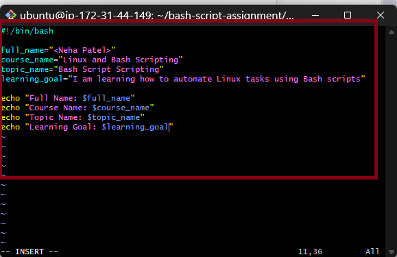

---

#### Screenshot 2 — Output of `./user-info.sh`

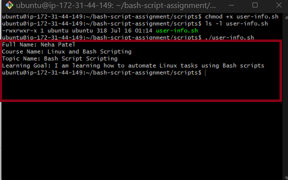

---

### Notes

Answer the following in your own words:

**1. What is a variable in Bash?**

A variable in Bash is used to store data, such as text or numbers, for later use in a script. It makes scripts easier to read, update, and reuse. Variables help avoid repeating the same values multiple times.

---

**2. Why should we avoid spaces around the `=` sign when creating variables?**

Bash does not allow spaces around the = sign when assigning a value to a variable.If spaces are added, Bash treats it as a command instead of a variable assignment. This results in an error.

---

**3. How do you access the value stored inside a Bash variable?**

Use the $ symbol before the variable name to access its value.For example, if the variable is name, use $name to display or use its value.This allows the stored data to be used anywhere in the script.

---

# Task 4 — Arrays & Loops: Tools Checklist Script

## Goal

Use arrays and loops to print a checklist of tools used in Bash scripting.

### Evidence

#### Screenshot 1 — Content of `tools-checklist.sh`

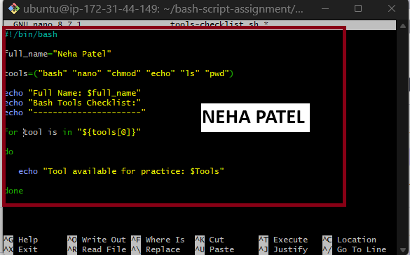

---

#### Screenshot 2 — Output of `./tools-checklist.sh`

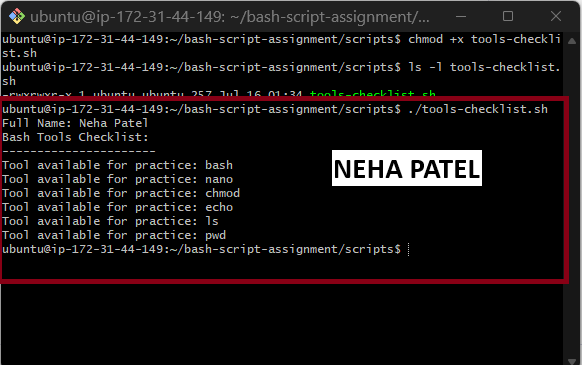

---

### Notes

Answer the following in your own words:

**1. What is an array in Bash?**

A Bash array is a variable that can store multiple values under one name.It helps organize related data and makes scripts easier to manage. Arrays improve the readability and maintainability of scripts.

---

**2. Why are arrays useful in scripts?**

Arrays allow us to store and manage multiple values without creating many separate variables.They make scripts shorter, cleaner, and easier to update.They are useful when working with lists of related data.

---

**3. What does `"${tools[@]}"` mean?**

"${tools[@]}" represents all the values stored in the tools array.It allows the script to access each array element one by one.
This is commonly used with loops to process every item.

---

**4. What is the purpose of the `for` loop in this script?**

The purpose of the for loop is to repeat the same set of commands for each item in a list. It allows the script to process multiple values automatically without writing the same code multiple times.

---

# Task 5 — Loops: Number Counter Script

## Goal

Use loops to repeat a task multiple times.

### Evidence

#### Screenshot 1 — Content of `counter.sh`

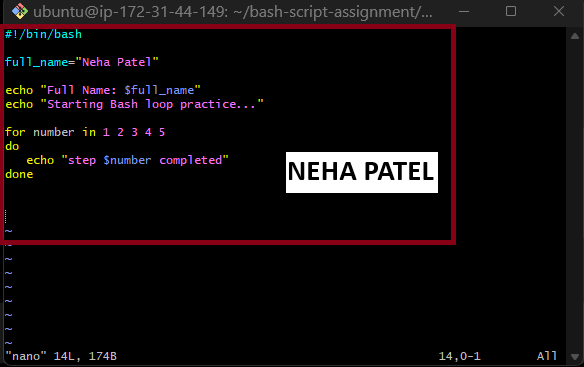

---

#### Screenshot 2 — Output of `./counter.sh`

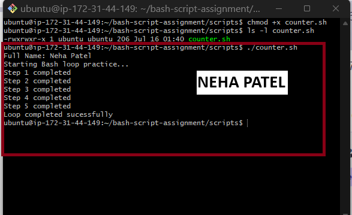

---

### Notes

Answer the following in your own words:

**1. What is a loop?**

We use loops to automate repetitive tasks, making scripts shorter, more efficient, and easier to maintain

---

**2. Why do we use loops in Bash scripting?**

We use loops to automate repetitive tasks, making scripts shorter, more efficient, and easier to maintain.

---

**3. How many times did the loop run in your script?**

The loop ran five times because it contained five values to iterate through

---

**4. What would you change if you wanted the loop to run 10 times?**

I would add five more values to the list (for example, numbers 6 through 10), so the loop would iterate a total of 10 times.

---

# Task 6 — Files & Conditionals: File Validation Script

## Goal

Use file checks and conditionals to verify whether files and directories exist.

### Evidence

#### Screenshot 1 — Output of `ls -lah ../test-folder`

Add your screenshot here.

---

#### Screenshot 2 — Content of `file-check.sh`

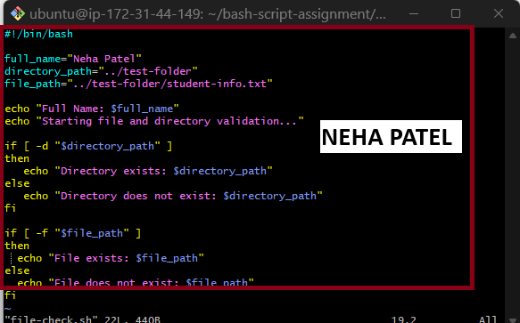

---

#### Screenshot 3 — Output of `./file-check.sh`

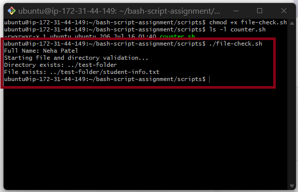

---

### Notes

Answer the following in your own words:

**1. What does `-d` check in Bash?**

The -d test checks whether a specified path exists and is a directory.

---

**2. What does `-f` check in Bash?**

The -f test checks whether a specified path exists and is a regular file.

---

**3. Why should file and directory paths be stored in variables?**

Storing file and directory paths in variables makes the script easier to read, update, and maintain. If the path changes, you only need to update the variable instead of changing it throughout the script.

---

**4. What happens if the file does not exist?**

If the file does not exist, the -f test returns false, and the script executes the else block (if one is provided), such as displaying a message that the file was not found.

---

# Task 7 — Conditionals: Pass or Retry Script

## Goal

Use if-else conditionals to make decisions based on a variable value.

### Evidence

#### Screenshot 1 — Content of `score-check.sh` with `score=85`

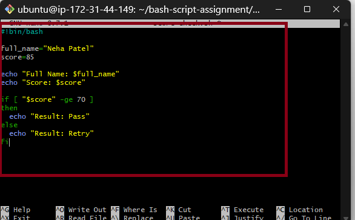

---

#### Screenshot 2 — Output showing `Result: Pass`

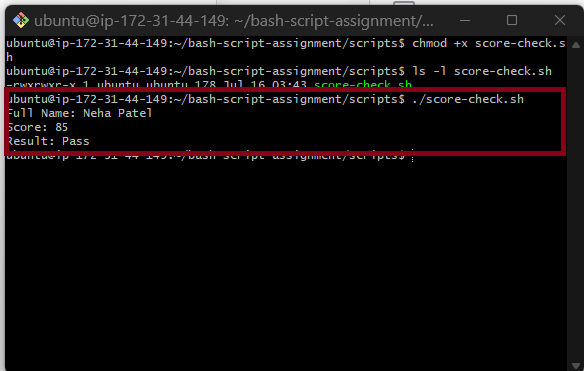

---

#### Screenshot 3 — Content of `score-check.sh` with `score=55`

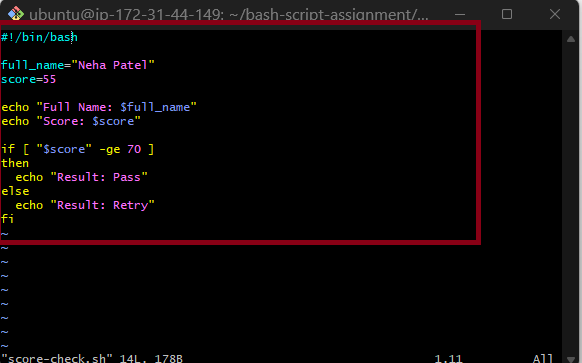

---

#### Screenshot 4 — Output showing `Result: Retry`

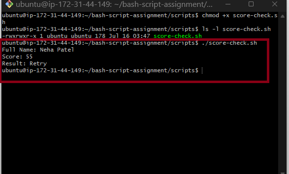

---

### Notes

Answer the following in your own words:

**1. What is the purpose of if-else in Bash?**

The if-else statement allows a script to make decisions by executing different commands based on whether a condition is true or false.

---

**2. What does `-ge` mean?**

-ge means greater than or equal to. It is used to compare two integer values in Bash

---

**3. Why should conditions be tested with different values?**

Conditions should be tested with different values to ensure the script works correctly in all scenarios and handles both true and false outcomes as expected.

---

**4. How can conditionals help in automation scripts?**

Conditionals help automation scripts make decisions automatically, such as checking if a file exists, verifying user input, or performing different actions based on system conditions. This makes scripts more flexible and reliable.

---

# Task 8 — Functions: Final Bash Automation Script

## Goal

Create a final Bash script using functions to organize reusable code.

### Evidence

#### Screenshot 1 — Content of `final-automation.sh`

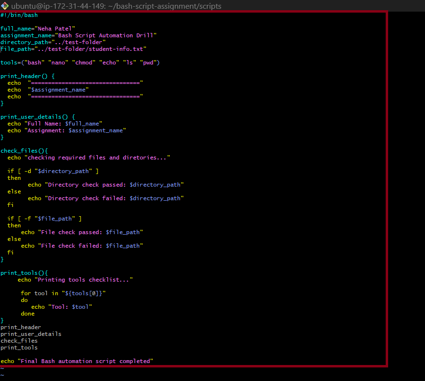

---

#### Screenshot 2 — Output of `./final-automation.sh`

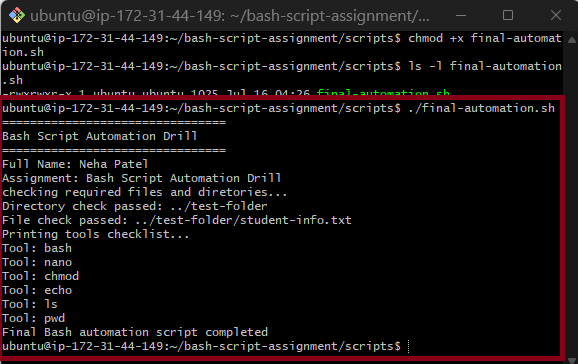

---

#### Screenshot 3 — Output of `ls -lah` showing all created scripts

Add your screenshot here.

---

### Notes

Answer the following in your own words:

**1. What is a function in Bash?**

A function is a reusable block of code that performs a specific task. It can be called whenever it is needed in a script.

---

**2. Why are functions useful in scripts?**

Functions make scripts easier to read, organize, and maintain. They also reduce code duplication by allowing the same code to be reused multiple times.

---

**3. Which functions did you create in this script?**

I created functions to organize different tasks in the script, such as displaying information, checking files or directories, and performing the main operations of the script.

---

**4. How does this final script combine variables, arrays, loops, conditionals, files, and functions?**

The script uses variables to store values, arrays to hold multiple items, loops to process each item, conditionals to make decisions based on different conditions, file checks to verify whether files or directories exist, and functions to organize the code into reusable sections. Together, these features make the script more efficient, readable, and easier to maintain.

---

# LinkedIn Post (Required)

## Evidence

#### LinkedIn Post URL

Paste your LinkedIn post URL here:

`Add your URL here`

---

#### Screenshot — Published LinkedIn post

Add your screenshot here.

---

# Submission Instructions

- Add all required screenshots in your submission
- Full name must be visible in required screenshots
- All script files must be created and run successfully
- Required notes must be answered clearly for every task
- Do not expose sensitive information (keys, passwords, credentials)

---

# Completion Checklist

- [ ] Task 1: Environment setup verified, workspace created (Screenshots 1–2, Notes answered)
- [ ] Task 2: First script created, executed, permissions verified (Screenshots 1–3, Notes answered)
- [ ] Task 3: Variables script created and run (Screenshots 1–2, Notes answered)
- [ ] Task 4: Arrays and loops script created and run (Screenshots 1–2, Notes answered)
- [ ] Task 5: Counter loop script created and run (Screenshots 1–2, Notes answered)
- [ ] Task 6: File validation script created and run (Screenshots 1–3, Notes answered)
- [ ] Task 7: Pass/Retry conditional script tested with both values (Screenshots 1–4, Notes answered)
- [ ] Task 8: Final automation script created and run (Screenshots 1–3, Notes answered)
- [ ] All scripts run without errors
- [ ] Full Name visible in all required screenshots
- [ ] LinkedIn post published and URL submitted
- [ ] No sensitive data exposed

---

## 📌 About DMI & CloudAdvisory

DevOps Micro Internship (DMI) is a project-based DevOps program run by Pravin Mishra (The CloudAdvisory) focused on real-world execution, systems thinking, and career readiness.

It helps learners build strong DevOps foundations with hands-on experience.

---

## 📌 Resources

- 🌐 DMI Official Website: https://pravinmishra.com/dmi  
- 🎓 DevOps for Beginners (Udemy): https://www.udemy.com/course/devops-for-beginners-docker-k8s-cloud-cicd-4-projects/  
- 🎓 Agentic AI DevOps with Claude Code: https://www.udemy.com/course/ultimate-agentic-ai-devops-with-claude-code/  
- 🎓 DevOps with Claude Code: Terraform, EKS, ArgoCD & Helm: https://www.udemy.com/course/devops-with-claude-code-terraform-eks-argocd-helm/  
- ▶️ YouTube Playlist: https://www.youtube.com/playlist?list=PLFeSNDtI4Cho  
- 🔗 Pravin Mishra (LinkedIn): https://www.linkedin.com/in/pravin-mishra-aws-trainer/  
- 🏢 CloudAdvisory (LinkedIn): https://www.linkedin.com/company/thecloudadvisory/

---

*This submission is part of DevOps Micro Internship (DMI) Cohort 3 — Agentic AI Track.*