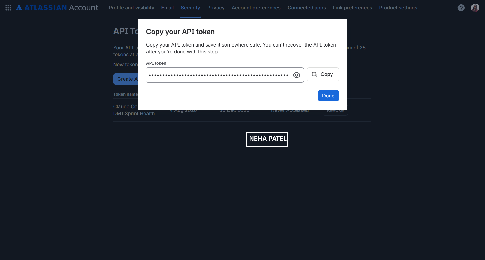
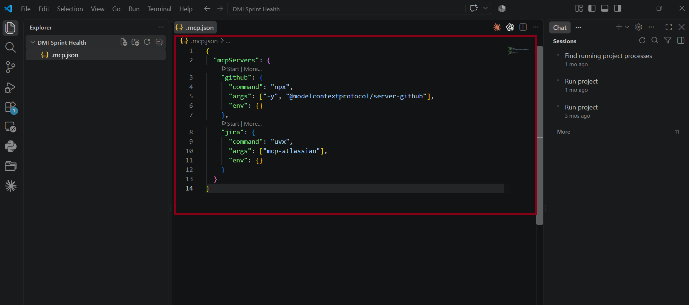
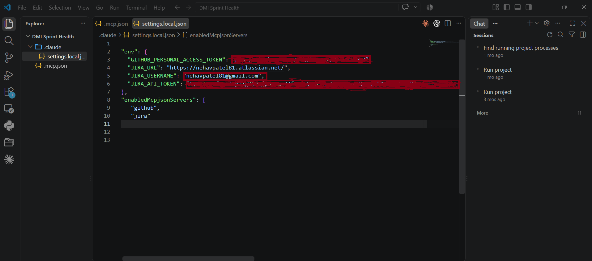
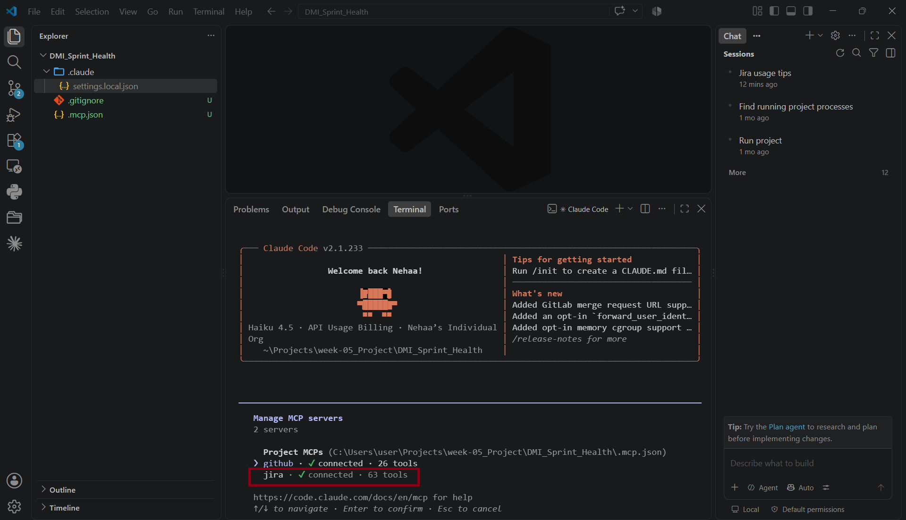
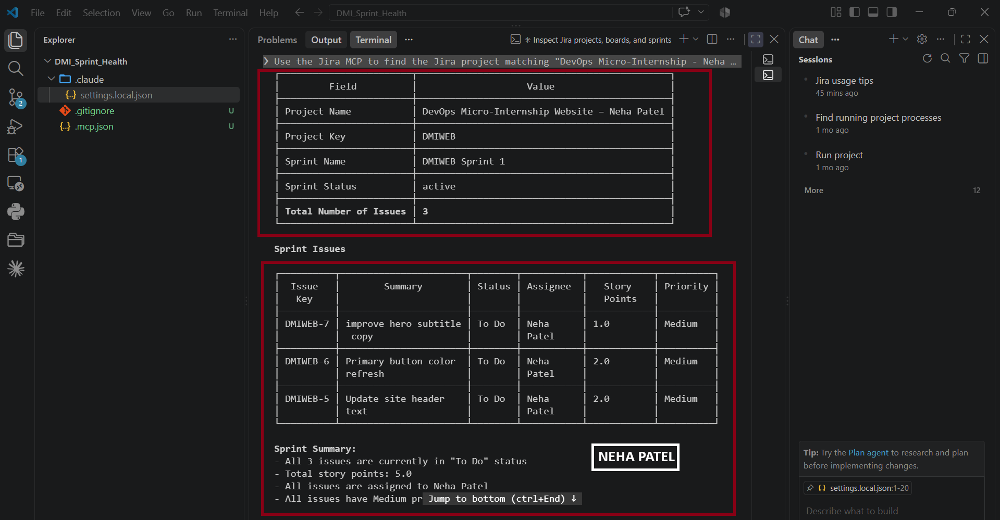
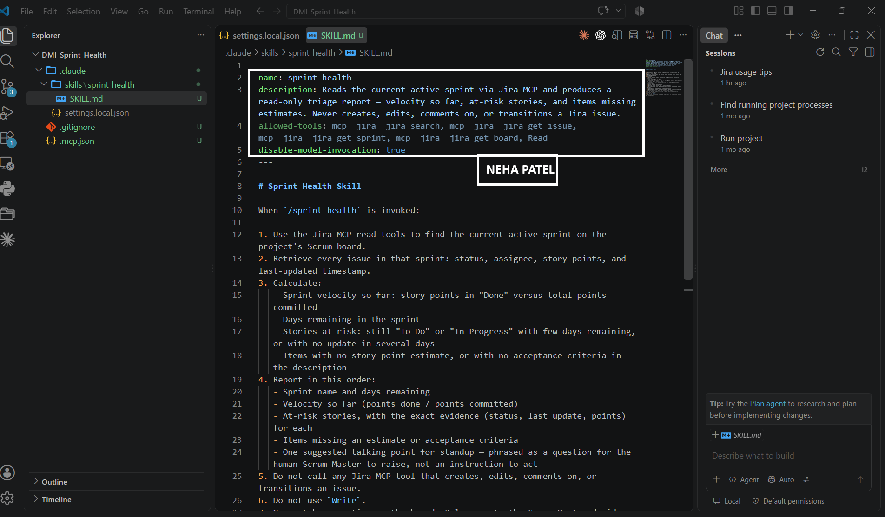
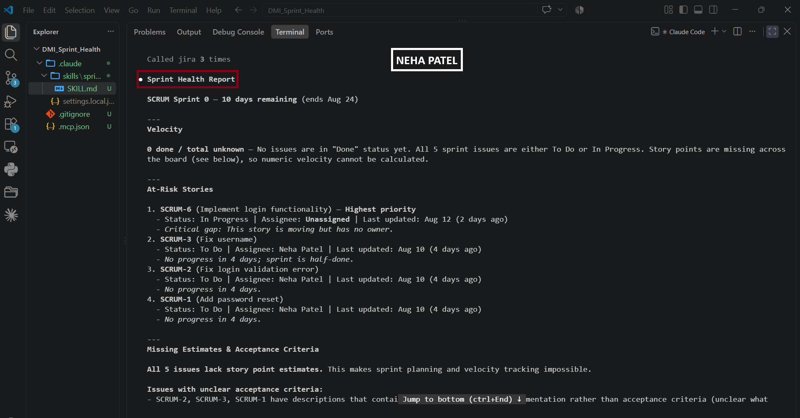
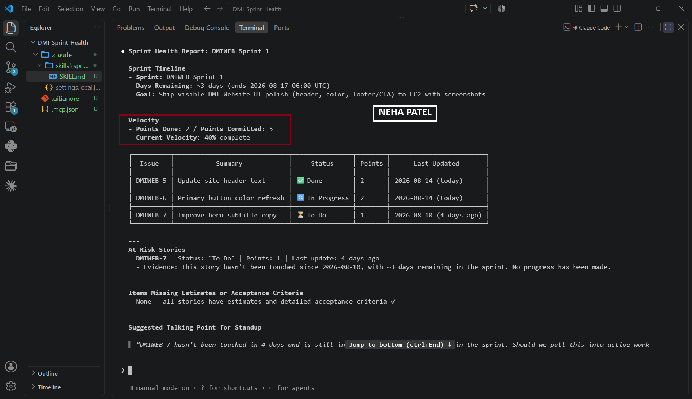

# Assignment 5 — AI-Assisted Sprint Health Report via Jira MCP

Part of the DevOps Micro Internship (DMI) Cohort 3 with Agentic AI

---

## Purpose

In this assignment, you will connect Claude Code to your Jira board through an MCP server, the same way you connected it to GitHub in Week 2, and build a read-only `/sprint-health` skill. The skill reads your current sprint through Jira's API and reports sprint velocity, stories at risk of missing the sprint, and items missing an estimate — but it must never create, edit, comment on, or transition a single ticket itself. You will prove that boundary holds by making a real change on the board yourself and confirming the skill only ever reports, never acts.

---

# Task 1 — Create a Jira API Token

## Goal

Generate an API token from your Atlassian account that the MCP server will use to authenticate with your Jira site. Do not screenshot the token value itself.

### Evidence

#### Screenshot 1 — Jira API token creation confirmation page showing the token name, with the token value not visible

### Notes You Must Write (Very Important):

Why does the MCP server need your site URL and account email in addition to the token?

The API token alone is not enough for the MCP server to connect to Jira. Jira’s REST API uses Basic Authentication, which requires both the Atlassian account email address and the API token.

Each piece of information has a specific purpose. The email address identifies the Atlassian account making the request, while the API token authenticates that account. The Jira site URL tells the MCP server which Jira instance it needs to connect to.

This is important because Atlassian hosts many different Jira instances. For example, your-site.atlassian.net identifies a specific Jira environment. In simple terms, the email identifies the account, the token verifies the account, and the site URL tells the MCP server where to send the request.

---

# Task 2 — Create .mcp.json at the Project Root

## Goal

Create or update `.mcp.json` at your project root with a Jira MCP server block, following the same shape as the GitHub MCP server you configured in Week 2.

### Evidence

#### Screenshot 2 — `.mcp.json` open in VS Code showing the Jira server configuration

### Notes You Must Write (Very Important):

Compare this jira block to the github block from Week 2 Assignment 5. The GitHub server ran via npx (a Node.js package); this one runs via uvx (a Python package) — what stays exactly the same shape despite that difference, and why doesn't Claude Code care which language a given MCP server is written in?

The shape that stays the same is the command / args / env structure. Regardless of whether the MCP server runs with npx (Node.js) or uvx (Python), each server configuration tells Claude Code which executable to run, what arguments to pass, and which environment variables to provide.

Claude Code does not care which programming language the MCP server is written in because it does not interact with the server’s source code. It simply launches the configured process and communicates with it using JSON-RPC messages over stdio, as defined by the MCP protocol. As long as the server correctly follows the MCP protocol, the underlying language—Node.js, Python, or another language—is invisible to Claude Code.

---

# Task 3 — Add Your Credentials to settings.local.json

## Goal

Add your Jira site URL, account email, and API token to `.claude/settings.local.json`, and confirm that file is listed in `.gitignore` so it is never committed.

### Evidence

#### Screenshot 3 — `settings.local.json` open in VS Code showing the `env` section, with the actual token value blurred or covered

### Notes You Must Write (Very Important):

Why must JIRA_API_TOKEN live in settings.local.json and never in .mcp.json?

The JIRA_API_TOKEN should be stored in settings.local.json because that file is local to your machine and is typically excluded from version control through .gitignore. In contrast, .mcp.json is intended to be committed and shared with the team.

Putting a real API token in .mcp.json could expose the credential to anyone who has access to the repository. Keeping it in settings.local.json protects the token by ensuring it stays on your local machine and is not accidentally committed to GitHub or shared with other team members.

In short, .mcp.json contains shared configuration, while settings.local.json contains private credentials and local settings.

---

# Task 4 — Verify the Connection with /mcp

## Goal

Restart Claude Code and confirm the Jira MCP server shows as connected.

### Evidence

#### Screenshot 4 — `/mcp` output showing `jira: connected`

---

# Task 5 — Run a Live Query to Prove Real Board Data

## Goal

Ask Claude to list the issues in your current active sprint through the Jira MCP connection, and confirm the result matches what you see on your live board in the browser.

### Evidence

#### Screenshot 5 — Claude's response showing the live sprint issue list retrieved via Jira MCP

### Notes You Must Write (Very Important):

How did you confirm this was real board data and not something Claude guessed?

I confirmed it was real board data by comparing Claude’s report with the actual Jira board side by side. The sprint name, issues, statuses, assignees, story points, and priorities in the report matched the information displayed on the live Jira board. This confirmed that the data was retrieved from Jira through the MCP rather than guessed or generated by Claude.

---

# Task 6 — Build the /sprint-health Skill

## Goal

Create a `/sprint-health` skill restricted to read-only Jira tools plus `Read`, with no issue-mutating tools and no `Write`. Run it and confirm it produces a report covering sprint velocity, at-risk stories, and items missing an estimate.

### Evidence

#### Screenshot 6 — `SKILL.md` frontmatter showing `allowed-tools` limited to read-only Jira tools plus `Read`, with `disable-model-invocation: true`

#### Screenshot 7 — `/sprint-health` output showing the full triage report against your real sprint

### Notes You Must Write (Very Important):

1. Which Jira MCP tools does this skill's allowed-tools list include, and which mutating tools (create issue, update issue, transition issue, add comment) does it deliberately exclude?

The allowed-tools list includes four Jira MCP tools: mcp__jira__jira_search, mcp__jira__jira_get_issue, mcp__jira__jira_get_sprint, and mcp__jira__jira_get_board, along with the general Read tool.

It deliberately excludes mutating tools such as jira_create_issue, jira_update_issue, jira_transition_issue, and jira_add_comment. This restriction is reinforced in the skill instructions: Step 5 explicitly prohibits using Jira tools that create, edit, comment on, or transition issues, while Step 7 states that the skill is strictly for reporting and that the Scrum Master makes any changes manually.

2. Why does a Scrum Master need this restriction more than almost any other role in this course?

A Scrum Master works with the entire team's Jira board, not just their own tickets. If an AI has permission to modify the board and makes a mistake, it could affect multiple people's work and corrupt information the team depends on for standups, sprint planning, and reporting.

Someone working only on their own issues has a more limited scope of impact. For a Scrum Master, keeping the skill read-only greatly reduces the risk of accidental changes to shared project data while still allowing the AI to provide useful reports and analysis.

---

# Task 7 — Prove the Skill Never Mutates the Board

## Goal

Manually update one ticket on your board in the browser (for example, move a story to "Done" or add a missing estimate), then run `/sprint-health` again and confirm the new report reflects your change — proving the skill only ever reads live state and never wrote to the board itself.

### Evidence

#### Screenshot 8 — Second `/sprint-health` run showing the report now reflects your manual board change

### Notes You Must Write (Very Important):

Map this assignment to Gather → Analyze → Human Act → Verify from Week 3 Assignment 6. Which step did you perform manually in the browser, and why must that step stay human?

The assignment maps directly to the Gather → Analyze → Human Act → Verify workflow:

Gather: The sprint-health skill reads Jira through MCP tools such as search, get issue, get sprint, and get board. It gathers information such as issue status, assignees, story points, and timestamps.
Analyze: The skill analyzes the Jira data by calculating velocity, identifying at-risk stories, finding items without estimates, and producing a report with suggested talking points.
Human Act: This step was performed manually in the Jira browser interface. After reviewing the AI-generated report, a person decides whether to move a ticket to Done, add a comment, or transition an issue. The actual change is made by logging into Jira and clicking through the interface.
Verify: After making the change, the human or team checks Jira to confirm that the ticket status is correct, the ticket is genuinely complete, and any comment added is accurate.

The Human Act step must remain human because changing a Jira ticket or adding a comment can have real consequences for the team. These actions require human judgment, context, and accountability. AI can recommend an action based on the available data, but it should not independently make a potentially consequential decision based on inferred intent.

---

# Submission Instructions

Complete all tasks in sequence.

Your submission must include:
- All 8 required screenshots
- All the required notes

---

# Completion Checklist

- [x] Task 1: Jira API token created, value never screenshotted (Screenshot 1)
- [x] Task 2: `.mcp.json` has the Jira server block (Screenshot 2)
- [x] Task 3: Credentials stored in `settings.local.json`, token blurred, file gitignored (Screenshot 3)
- [x] Task 4: `/mcp` shows the Jira server connected (Screenshot 4)
- [x] Task 5: Live query returned real sprint data, verified against the browser (Screenshot 5)
- [x] Task 6: `/sprint-health` skill created with correct read-only `allowed-tools`, and produced a full report (Screenshots 6–7)
- [x] Task 7: A manual board change was reflected in a second `/sprint-health` run (Screenshot 8)
- [x] Skill never created, edited, transitioned, or commented on any issue
- [x] Reflection answered (Notes)
- [x] No API token value exposed

---

## 📌 About DMI & CloudAdvisory

DevOps Micro Internship (DMI) is a project-based DevOps program run by Pravin Mishra (The CloudAdvisory) focused on real-world execution, systems thinking, and career readiness.

It helps learners build strong DevOps foundations with hands-on experience.

---

## 📌 Resources

- 🌐 DMI Official Website: https://dmi.pravinmishra.com?utm_source=github&utm_medium=readme  
- 🎓 University: https://university.pravinmishra.com?utm_source=github&utm_medium=readme  
- 💬 Discord Community: https://discord.pravinmishra.com?utm_source=github&utm_medium=readme  
- 📝 Blog: https://dmi.pravinmishra.com/blog?utm_source=github&utm_medium=readme  
- ▶️ YouTube Playlist: https://www.youtube.com/playlist?list=PLFeSNDtI4Cho  
- 🔗 Pravin Mishra (LinkedIn): https://www.linkedin.com/in/pravin-mishra-aws-trainer/  
- 🏢 CloudAdvisory (LinkedIn): https://www.linkedin.com/company/thecloudadvisory/

---

*This submission is part of DevOps Micro Internship (DMI) Cohort 3 — Agentic AI Track.*
