# Assignment 2 — Create an AWS EC2 Virtual Machine Using Terraform

Part of the DevOps Micro Internship (DMI) Cohort 3 with Agentic AI

---

## Purpose

In this assignment, you will use Terraform to provision a complete AWS environment consisting of a custom VPC, public and private subnets, an Internet Gateway, a public route table, a security group, and an EC2 instance deployed inside the public subnet.

You will configure SSH and HTTP access, install Nginx, capture the EC2 instance’s public IP address, verify the deployment using AWS CLI and a web browser, and destroy all Terraform-managed resources after testing.

---

# Task 0 — Set Up and Verify the Terraform and AWS CLI Environment

## Goal

Prepare your local environment for Terraform deployment by installing Terraform, AWS CLI, and the HashiCorp Terraform extension in VS Code, configuring AWS CLI with your AWS account, and confirming that all required tools are working correctly.

### Evidence

#### Screenshot 1 — Terminal showing successful `aws --version` output

Ensure that your full name is visible and that no AWS credentials, account IDs, or other sensitive information are exposed.

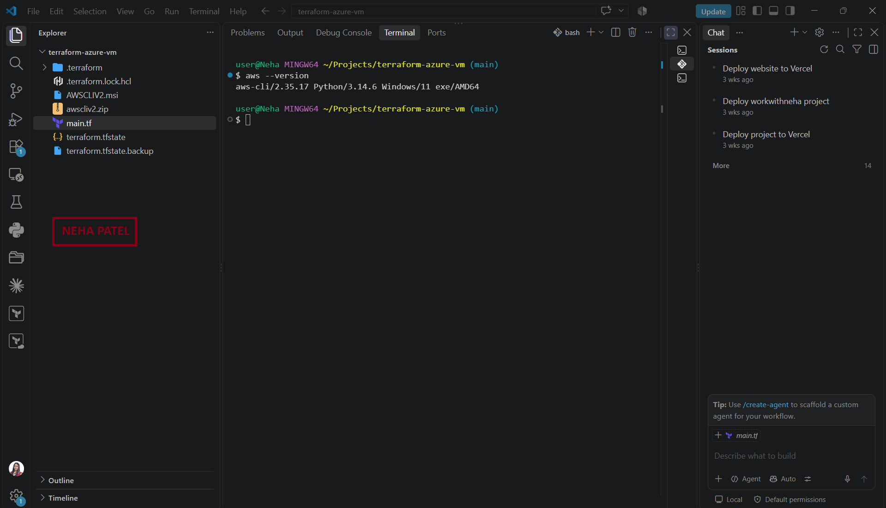.

---

# Task 1 — Create a New Terraform Project and Define the Infrastructure

## Goal

Create a new Terraform project and define the complete AWS EC2 environment in `main.tf` by using the official Terraform Registry documentation.

The configuration must include:

* Terraform and AWS provider configuration
* Custom VPC using the CIDR block `10.0.0.0/16`
* Public subnet using the CIDR block `10.0.1.0/24`
* Private subnet using the CIDR block `10.0.2.0/24`
* Internet Gateway
* Public route table with a route to `0.0.0.0/0`
* Public subnet route table association
* Security group allowing SSH on port `22`
* Security group allowing HTTP on port `80`
* EC2 instance deployed inside the public subnet
* SSH authentication configuration
* Public IP address association
* Public IP output block

### Evidence

#### Screenshot 2 — VS Code showing the AWS provider configuration and VPC configuration in `main.tf`

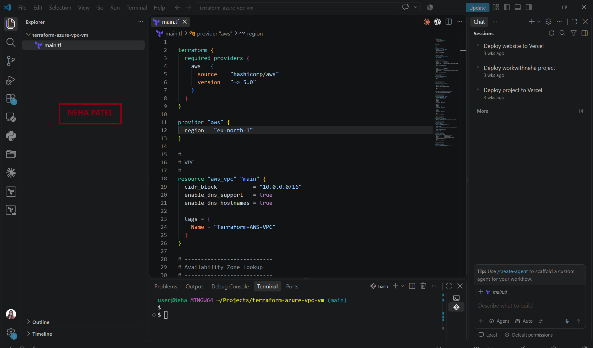

---

#### Screenshot 3 — VS Code showing the EC2 instance configuration and public IP `output` block in `main.tf`

Ensure that no AWS credentials, private keys, account IDs, or other sensitive information are visible.

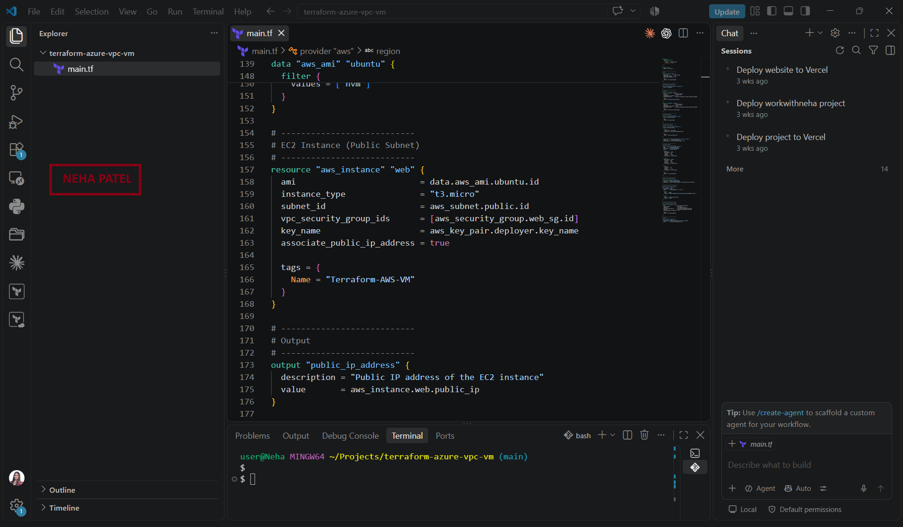

---

# Task 2 — Initialize Terraform

## Goal

Initialize the Terraform working directory and download the required provider components.

### Evidence

#### Screenshot 4 — Terminal showing the successful `terraform init` output

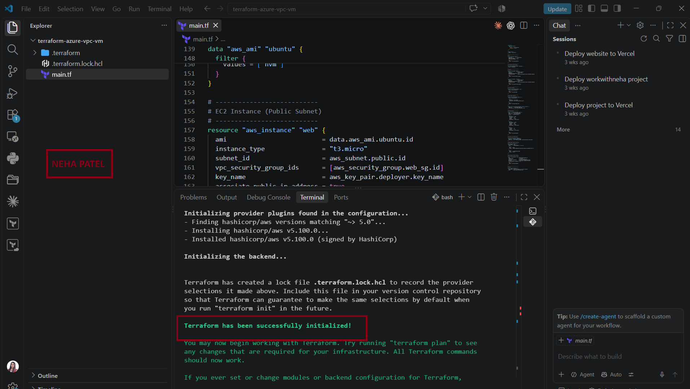

---

# Task 3 — Plan and Apply the Configuration

## Goal

Review the Terraform execution plan, provision the AWS resources, and record the EC2 instance’s public IP address from the Terraform output.

### Evidence

#### Screenshot 5 — Terraform plan summary showing the proposed resources

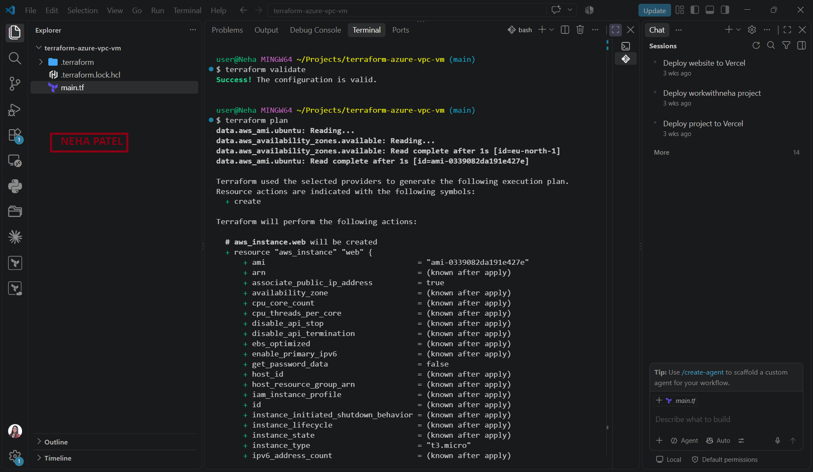
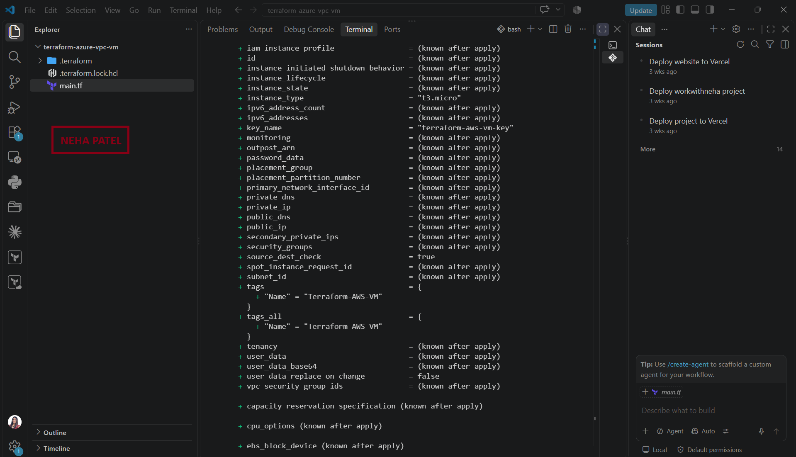
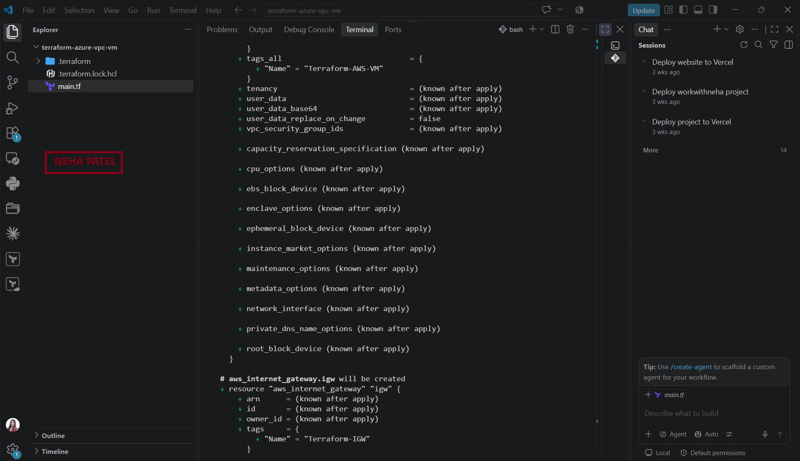
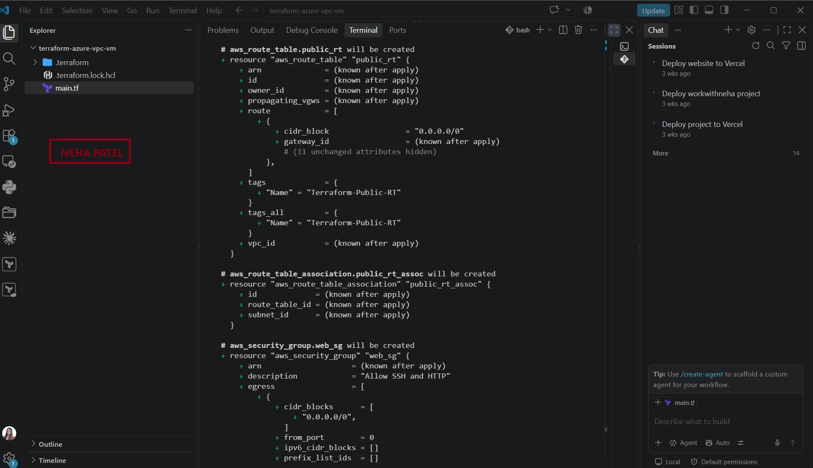

---

#### Screenshot 6 — Terraform apply output showing successful completion

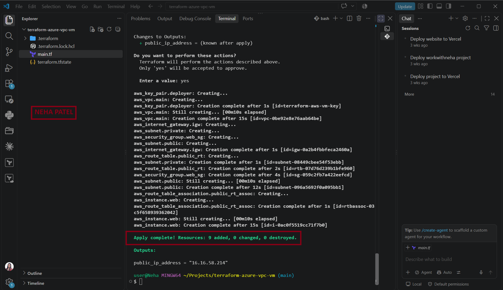

---

#### Screenshot 7 — Terraform output showing the public IP address of the EC2 instance

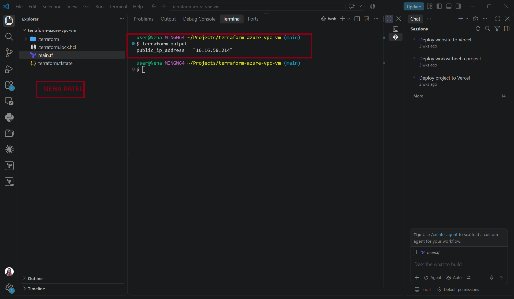

---

### EC2 Public IP Address

Record the public IP address displayed by `terraform output`.

**EC2 Public IP Address:** 16.16.58.214

---

# Task 4 — Verify the Deployment

## Goal

Confirm through AWS CLI that the EC2 instance was created successfully and is running, and verify HTTP access through the instance public IP.

Confirm that:

* The EC2 instance appears in the AWS CLI output.
* The EC2 instance state shows `running`.
* The public IP shown by AWS matches the public IP recorded from Terraform.
* Nginx is installed and running.
* The Nginx page is accessible through the EC2 instance’s public IP.

### Evidence

#### Screenshot 8 — AWS CLI output showing the EC2 instance ID, `running` state, and public IP address

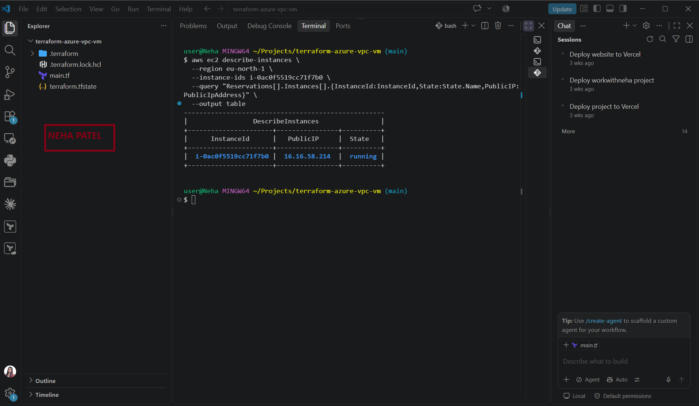

---

#### Screenshot 9 — Browser showing the Nginx page successfully loaded using the EC2 instance public IP

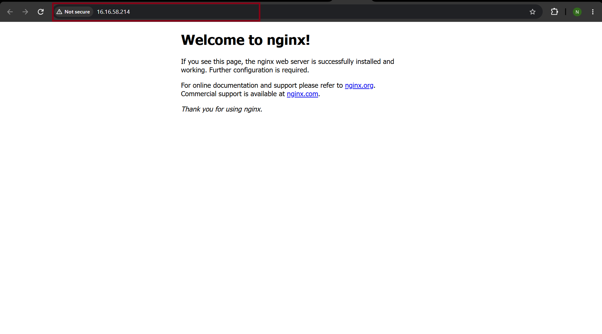

---

# Task 5 — Destroy the Resources

## Goal

Remove all AWS resources created by Terraform after completing the deployment and verification.

### Evidence

#### Screenshot 10 — Terminal showing successful `terraform destroy` completion

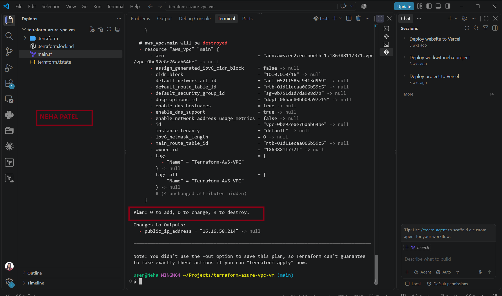

---

# Submission Instructions

* Complete all tasks in sequence.
* Include all required screenshots specified in Tasks 0–5.
* Ensure that your full name is visible in the required screenshots.
* Record the EC2 public IP address in Task 3.
* Follow the screenshot requirements exactly as specified.
* Ensure that the submitted evidence clearly matches the required task outputs.
* Do not expose AWS access keys, secret keys, private keys, passwords, account IDs, or other sensitive information.
* Do not upload your private key file (`.pem`) to your GitHub repository.
* Review your submission carefully before submitting it through GitHub.

---

# Completion Checklist

* [x] Installed Terraform and verified it using `terraform version`
* [x] Installed AWS CLI and verified it using `aws --version`
* [x] Configured AWS CLI and verified account access
* [x] Confirmed the correct AWS Region
* [x] Installed and enabled the HashiCorp Terraform extension in VS Code
* [x] Created the `terraform-aws-vm` project directory and `main.tf`
* [x] Added the Terraform and AWS provider configuration
* [x] Defined the custom VPC, public subnet, and private subnet
* [x] Configured the Internet Gateway and public route table
* [x] Configured the Internet Gateway and public route table
* [x] Configured the Internet Gateway and public route table
* [x] Associated the public route table with the public subnet
* [x] Defined the security group for SSH and HTTP access
* [x] Restricted SSH access to my public IP whenever possible
* [x] Defined the EC2 instance inside the public subnet
* [x] Configured SSH authentication without exposing the private key
* [x] Added the Terraform output for the EC2 public IP address
* [x] Completed `terraform init` successfully
* [x] Reviewed the Terraform execution plan using `terraform plan`
* [x] Completed `terraform apply` successfully
* [x] Captured and recorded the EC2 public IP using `terraform output`
* [x] Verified that the EC2 instance is running using AWS CLI
* [x] Verified that the AWS public IP matches the Terraform output
* [x] Verified Nginx access through the EC2 public IP
* [x] Completed `terraform destroy` successfully
* [x] Captured all 10 required screenshots
* [x] Confirmed that my full name is visible in the required screenshots
* [x] Checked that no AWS credentials, private keys, passwords, account IDs, or other sensitive information are visible
* [x] Confirmed that no `.pem` private key file has been uploaded to the GitHub repository

---

## 📌 About DMI & CloudAdvisory

DevOps Micro Internship (DMI) is a project-based DevOps program run by Pravin Mishra (The CloudAdvisory), focused on real-world execution, systems thinking, and career readiness.

It helps learners build strong DevOps foundations through hands-on experience.

---

## 📌 Resources

* 🌐 DMI Official Website: https://dmi.pravinmishra.com?utm_source=github&utm_medium=readme
* 🎓 University: https://university.pravinmishra.com?utm_source=github&utm_medium=readme
* 💬 Discord Community: https://discord.pravinmishra.com?utm_source=github&utm_medium=readme
* 📝 Blog: https://dmi.pravinmishra.com/blog?utm_source=github&utm_medium=readme
* ▶️ YouTube Playlist: https://www.youtube.com/playlist?list=PLFeSNDtI4Cho
* 🔗 Pravin Mishra (LinkedIn): https://www.linkedin.com/in/pravin-mishra-aws-trainer/
* 🏢 CloudAdvisory (LinkedIn): https://www.linkedin.com/company/thecloudadvisory/

---

*This submission is part of the DevOps Micro Internship (DMI) Cohort 3 — Agentic AI Track.*
