# Assignment 4 — Deploy EpicBook Web App on AWS Using Terraform Modules and Amazon RDS for MySQL

Part of the DevOps Micro Internship (DMI) Cohort 3 with Agentic AI

---

## Purpose

In this assignment, you will use reusable Terraform modules to provision the AWS infrastructure required by EpicBook. You will create a custom VPC, one public subnet, two private database subnets across different Availability Zones, an Internet Gateway, a public route table, Security Groups, an EC2 Linux instance, and a private Amazon RDS for MySQL database.

You will use EC2 `user_data` to install the required software, initialize the EpicBook database, connect the application to Amazon RDS, configure Nginx, validate the complete browser-to-database workflow, destroy the resources after testing, and publish the required LinkedIn post.

---

# Task 0 — Set Up and Verify the Terraform and AWS CLI Environment

## Goal

Prepare your local environment by installing Terraform, AWS CLI, and the HashiCorp Terraform extension in VS Code, configuring AWS CLI, and confirming that all required tools are working correctly.

## Evidence

### Screenshot 1 — Terraform Version

Add a screenshot of the terminal showing successful `terraform version` output.

Add your screenshot here.

---

### Screenshot 2 — AWS CLI Version

Add a screenshot of the terminal showing successful `aws --version` output.

Add your screenshot here.

---

### Screenshot 3 — HashiCorp Terraform Extension

Add a screenshot of VS Code showing the HashiCorp Terraform extension installed and enabled.

Add your screenshot here.

---

# Task 1 — Create the Modular Terraform Project

## Goal

Create the Terraform project and organize the AWS infrastructure into separate Network, EC2, and RDS modules.

The completed project structure must include the root Terraform files, all three module directories, and `user_data.sh`:

```text
terraform-aws-epicbook/
├── main.tf
├── variables.tf
├── outputs.tf
├── terraform.tfvars
└── modules/
    ├── network/
    │   ├── main.tf
    │   ├── variables.tf
    │   └── outputs.tf
    ├── ec2/
    │   ├── main.tf
    │   ├── variables.tf
    │   ├── outputs.tf
    │   └── user_data.sh
    └── rds/
        ├── main.tf
        ├── variables.tf
        └── outputs.tf
```

## Evidence

### Screenshot 4 — Modular Project Structure

Add a screenshot of the VS Code Explorer showing the complete root project and the `network`, `ec2`, and `rds` module directory structure.

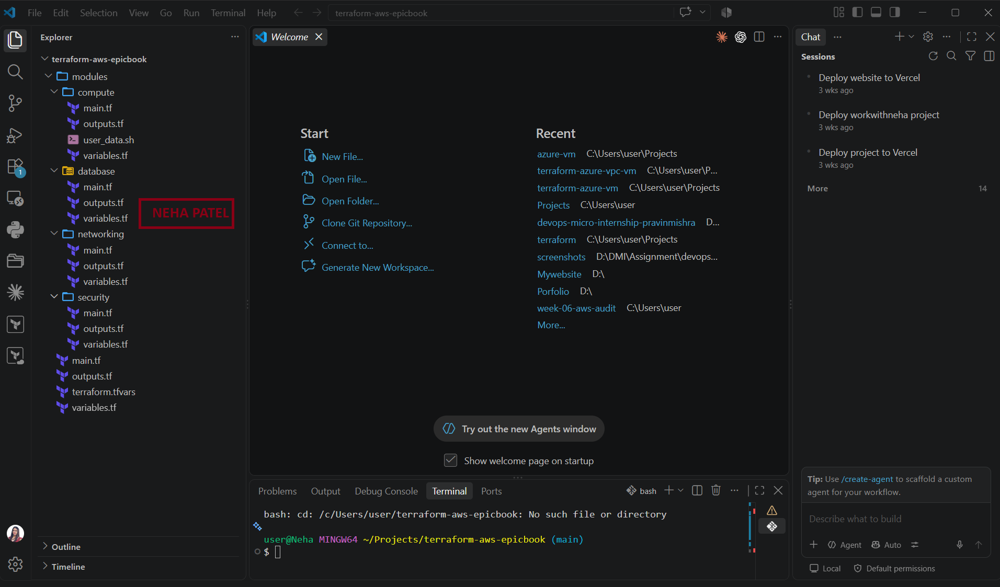

---

# Task 2 — Build the Network Module

## Goal

Create a reusable Terraform network module containing the VPC, subnets, Internet Gateway, routing, and Security Groups required by EpicBook.

The network module must include:

- VPC: `10.0.0.0/16`
- Public subnet: `10.0.1.0/24`
- Private database subnet A: `10.0.2.0/24`
- Private database subnet B: `10.0.3.0/24`
- Private database subnets in different Availability Zones
- Internet Gateway
- Public route table and public-subnet association
- EC2 Security Group allowing SSH and HTTP
- RDS Security Group allowing MySQL port `3306` only from the EC2 Security Group
- Network module variables and outputs

## Evidence

### Screenshot 5 — VPC and Subnets

Add a screenshot of VS Code showing the VPC, public subnet, and two private database subnet configurations.

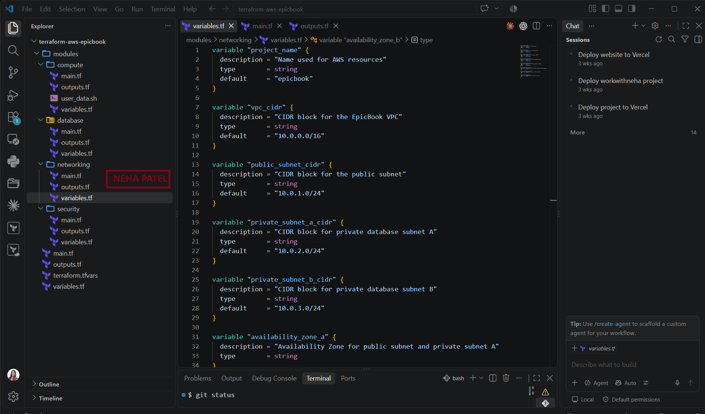

---

### Screenshot 6 — Internet Gateway and Public Routing

Add a screenshot of VS Code showing the Internet Gateway, public route table, and route table association.

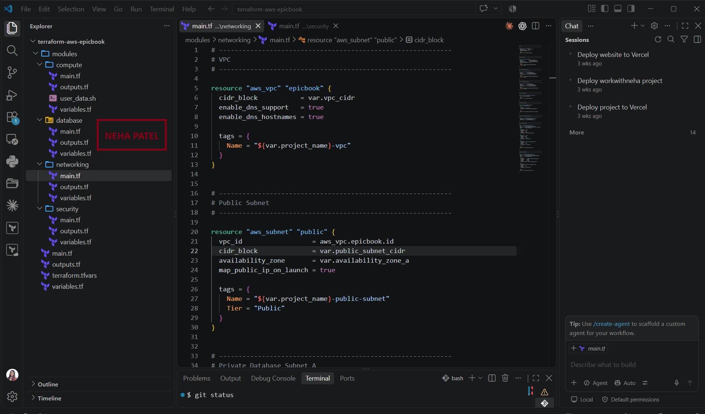

---

### Screenshot 7 — EC2 and RDS Security Groups

Add a screenshot of VS Code showing the EC2 and RDS Security Groups, including MySQL access from the EC2 Security Group only.


---

### Screenshot 8 — Network Module Outputs

Add a screenshot of VS Code showing the network module outputs.

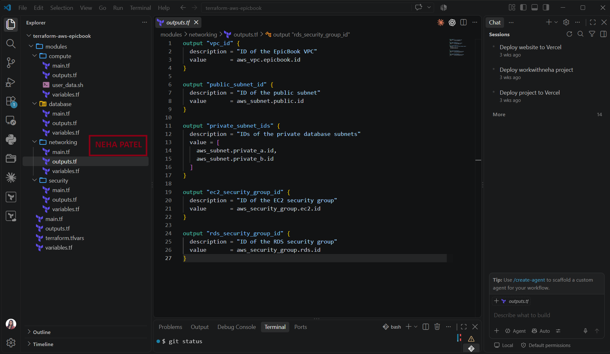

---

# Task 3 — Build the EC2 Module and User Data Installation Script

## Goal

Create an EC2 module that launches the EpicBook application server inside the public subnet and automatically installs the required server software using EC2 user data.

The EC2 module must:

- Deploy the instance inside the public subnet
- Use the EC2 Security Group from the Network module
- Use a supported Ubuntu LTS AMI
- Assign a public IPv4 address
- Use an EC2 key pair for SSH authentication
- Connect `user_data.sh` through the EC2 `user_data` argument
- Expose the EC2 instance ID and public IP

The `user_data.sh` script must install the required software without storing database credentials or other secrets.

## Evidence

### Screenshot 9 — EC2 Resource and `user_data`

Add a screenshot of VS Code showing the EC2 resource and `user_data` configuration.

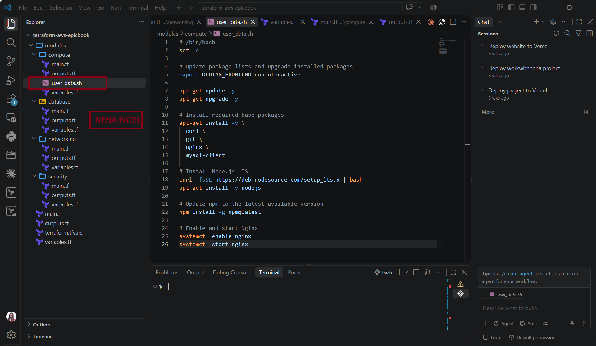

---

### Screenshot 10 — `user_data.sh`

Add a screenshot of VS Code showing `user_data.sh`.

Ensure that no credentials, passwords, private keys, access tokens, or application secrets are visible.

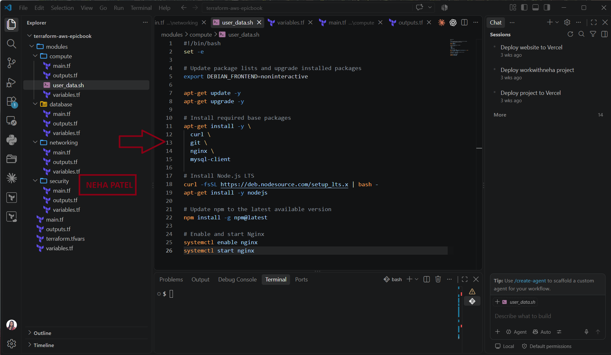

---

### Screenshot 11 — EC2 Module Variables and Outputs

Add a screenshot of VS Code showing the EC2 module variables and outputs.

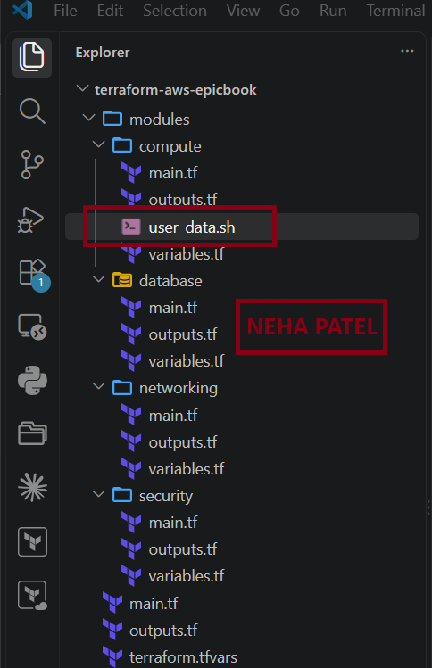

---

# Task 4 — Build the Amazon RDS Module

## Goal

Create an RDS module that provisions Amazon RDS for MySQL inside private database subnets.

The RDS module must include:

- A DB subnet group using both private database subnets
- Amazon RDS for MySQL
- RDS Security Group reference
- `publicly_accessible = false`
- Sensitive variables for database credentials
- RDS endpoint output
- No password output

## Evidence

### Screenshot 12 — DB Subnet Group and RDS MySQL

Add a screenshot of VS Code showing the DB subnet group and RDS MySQL configuration.

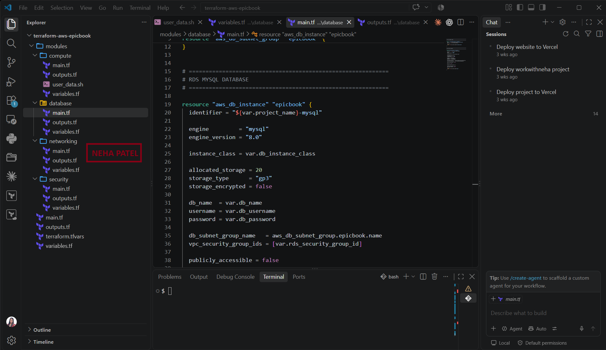

---

### Screenshot 13 — Private RDS and Sensitive Variables

Add a screenshot of VS Code showing `publicly_accessible = false`, the RDS Security Group configuration or reference, and the sensitive database variable configuration.

Ensure that the database password and other sensitive values are hidden.

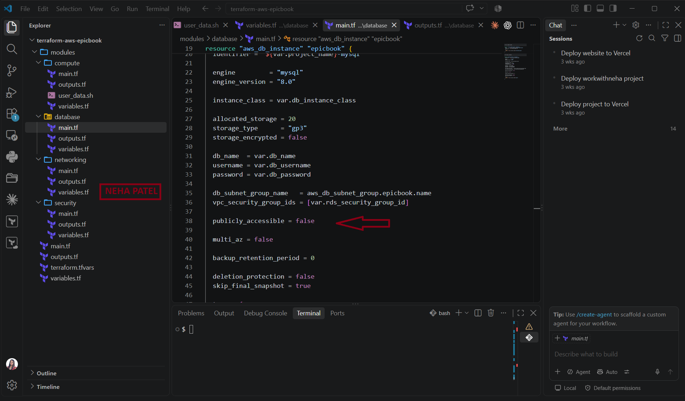

---

### Screenshot 14 — RDS Endpoint Output

Add a screenshot of VS Code showing the RDS endpoint output.

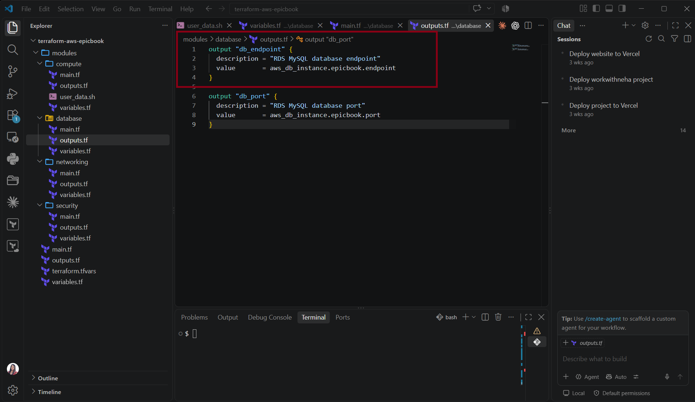

---

# Task 5 — Connect the Terraform Modules from the Root Module

## Goal

Use the root Terraform configuration to call the Network, EC2, and RDS modules and pass values between them.

## Evidence

### Screenshot 15 — Root Module Blocks

Add a screenshot of VS Code showing the root `main.tf` with the Network, EC2, and RDS module blocks.

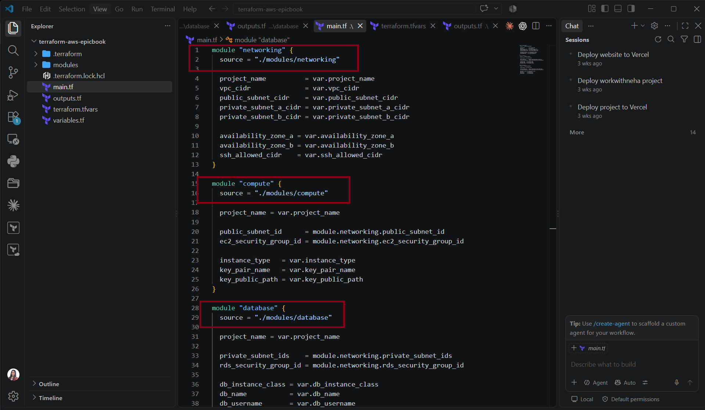

---

### Screenshot 16 — Values Passed Between Modules

Add a screenshot of VS Code showing values passed from the Network module to the EC2 and RDS modules.

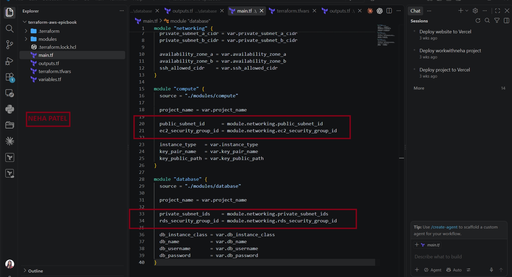

---

### Screenshot 17 — Root Outputs

Add a screenshot of VS Code showing the root EC2 public IP and RDS endpoint outputs.

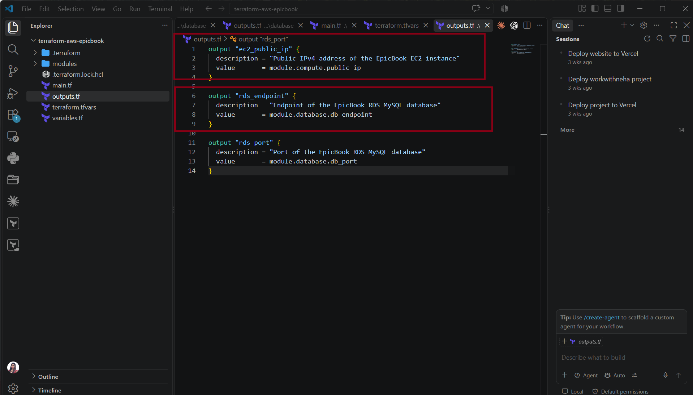

---

# Task 6 — Initialize, Validate, Plan, and Apply the Terraform Configuration

## Goal

Initialize the modular Terraform project, validate the configuration, review the execution plan, and provision the AWS infrastructure.

## Evidence

### Screenshot 18 — Terraform Initialization

Add a screenshot of the terminal showing successful `terraform init` output.

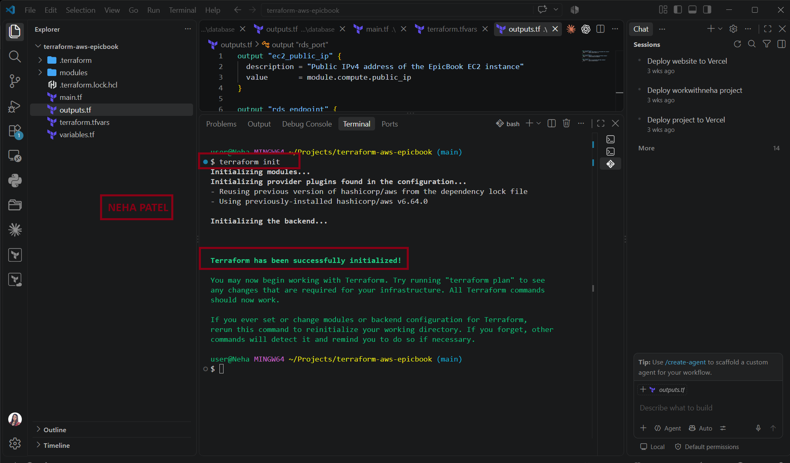

---

### Screenshot 19 — Terraform Validation

Add a screenshot of the terminal showing successful `terraform validate` output.

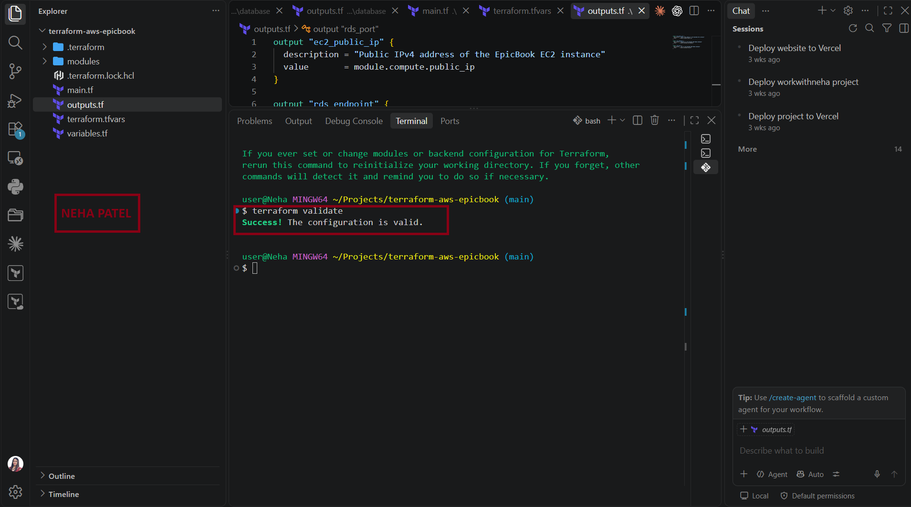

---

### Screenshot 20 — Terraform Plan

Add a screenshot showing the Terraform plan summary and proposed resources.

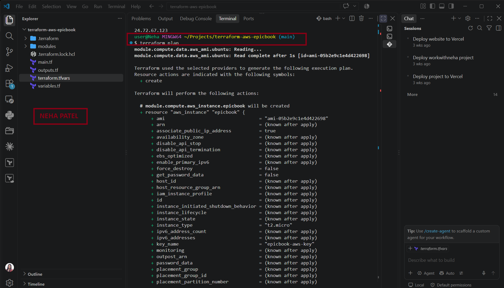

---

### Screenshot 21 — Terraform Apply

Add a screenshot showing successful `terraform apply` completion.


---

### Screenshot 22 — Terraform Outputs

Add a screenshot showing the EC2 public IP and RDS endpoint returned by `terraform output`.


---

# Task 7 — Verify EC2, User Data, and Amazon RDS

## Goal

Verify that the EC2 and RDS resources were successfully provisioned and confirm that the EC2 user data script installed the required software.

## Evidence

### Screenshot 23 — EC2 Running

Add a screenshot of AWS CLI showing the EC2 instance running.


---

### Screenshot 24 — Private RDS Available

Add a screenshot of AWS CLI showing that RDS is available and not publicly accessible.


---

### Screenshot 25 — Installed Software and Nginx

Add a screenshot of the EC2 terminal showing the required software version checks and the active Nginx service.


---

# Task 8 — Prepare the EpicBook Database

## Goal

Connect from EC2 to Amazon RDS, create the EpicBook database, import the schema and seed data, and verify the database contents.

## Evidence

### Screenshot 26 — EC2-to-RDS Connection

Add a screenshot of the terminal showing a successful connection from EC2 to Amazon RDS.

Ensure that the database password is not visible.


---

### Screenshot 27 — EpicBook Tables and Imported Data

Add a screenshot of the terminal showing the EpicBook tables and imported data.


---

# Task 9 — Deploy and Configure the EpicBook Application

## Goal

Install EpicBook dependencies, configure the application to use Amazon RDS, configure Nginx as a reverse proxy, and start the application.

## Evidence

### Screenshot 28 — Dependencies and `node_modules`

Add a screenshot of the terminal showing successful dependency installation and the `node_modules` directory.


---

### Screenshot 29 — Nginx Configuration and Service

Add a screenshot of the terminal showing a successful Nginx configuration test and active service status.


---

### Screenshot 30 — EpicBook on Port `8080`

Add a screenshot of the terminal showing EpicBook running or listening on port `8080`.


---

# Task 10 — Test End-to-End Functionality

## Goal

Verify that EpicBook, EC2, Nginx, and Amazon RDS work together successfully.

## EC2 Public IP URL

**EC2 Public IP URL:** Add the working EpicBook EC2 public IP URL here

## Evidence

### Screenshot 31 — EpicBook Through the EC2 Public IP

Add a screenshot of the browser showing EpicBook using the EC2 public IP.

Add your screenshot here.

---

### Screenshot 32 — Cart or Checkout Action

Add a screenshot of the browser showing a successful cart or checkout action.

Add your screenshot here.

---

### Screenshot 33 — Corresponding RDS Record

Add a screenshot of the terminal showing the corresponding RDS database record created by the application action.

Ensure that database credentials and other sensitive values are not visible.

Add your screenshot here.

---

# Task 11 — Destroy the Terraform Infrastructure

## Goal

Remove all AWS resources created by the modular Terraform configuration.

## Evidence

### Screenshot 34 — Terraform Destroy

Add a screenshot of the terminal showing successful `terraform destroy` completion.

Add your screenshot here.

---

# Task 12 — LinkedIn Post (Mandatory)

## Goal

Share what you built and learned from the modular AWS Terraform deployment.

Write the post in your own words and include at least one deployment screenshot or other proof. Ensure that the post can be viewed by the submission reviewer.

## Evidence

### Screenshot 35 — Published LinkedIn Post

Add a screenshot of the published LinkedIn post showing the post and at least one deployment image or other proof.

Add your screenshot here.

## LinkedIn Post URL

**LinkedIn Post URL:** Add your LinkedIn post URL here

---

# Submission Instructions

- Complete Tasks 0–12 in sequence.
- Include all Screenshots 1–35 exactly as specified.
- Ensure that your full name is visible in the required screenshots.
- Include the working EpicBook EC2 public IP URL.
- Include the published LinkedIn post URL.
- Include proof of frontend, backend, and database integration.
- Ensure that the required Terraform root files, module files, and `user_data.sh` are included in the GitHub submission.
- Do not upload Terraform state files, `.pem` files, or a `terraform.tfvars` file containing passwords or other sensitive values.
- Do not expose AWS credentials, account IDs, private SSH keys, RDS passwords, access tokens, Terraform sensitive values, or other confidential information.
- Review all screenshots and files carefully before submitting through GitHub.

---

# Completion Checklist

- [x] Installed and verified Terraform
- [x] Installed and verified AWS CLI
- [x] Configured AWS CLI
- [x] Confirmed the AWS Region
- [x] Installed the HashiCorp Terraform extension
- [x] Created the modular Terraform project
- [x] Created the root `main.tf`, `variables.tf`, and `outputs.tf`
- [x] Created the Network module
- [x] Created the EC2 module
- [x] Created the RDS module
- [x] Created the EC2 `user_data.sh`
- [x] Created VPC `10.0.0.0/16`
- [x] Created public subnet `10.0.1.0/24`
- [x] Created private DB subnet A `10.0.2.0/24`
- [x] Created private DB subnet B `10.0.3.0/24`
- [x] Used different Availability Zones for the database subnets
- [x] Created and attached the Internet Gateway
- [x] Created the public route table
- [x] Associated the public subnet with the public route table
- [x] Created the EC2 Security Group
- [x] Allowed HTTP port `80`
- [x] Restricted SSH port `22`
- [x] Created the RDS Security Group
- [x] Allowed MySQL port `3306` from the EC2 Security Group only
- [x] Exposed the required Network module outputs
- [x] Defined the EC2 instance
- [x] Connected `user_data.sh` using the EC2 `user_data` argument
- [x] Configured EC2 with a public IP
- [x] Installed the required software using user data
- [x] Created the RDS DB subnet group
- [x] Created Amazon RDS for MySQL
- [x] Confirmed RDS is not publicly accessible
- [x] Configured sensitive database variables
- [x] Exposed the RDS endpoint
- [x] Connected all modules through the root module
- [x] Passed Network module outputs to EC2 and RDS
- [x] Added root EC2 public IP and RDS endpoint outputs
- [x] Completed `terraform init`
- [x] Completed `terraform validate`
- [x] Reviewed `terraform plan`
- [x] Completed `terraform apply`
- [x] Verified EC2 is running
- [x] Verified RDS is available
- [x] Verified user data installation
- [x] Connected to EC2 using SSH
- [x] Cloned EpicBook
- [x] Created the `bookstore` database
- [x] Imported the database schema
- [x] Imported author seed data
- [x] Imported book seed data
- [x] Verified database records
- [x] Installed EpicBook dependencies
- [x] Configured EpicBook to use RDS
- [x] Configured Nginx
- [x] Started EpicBook
- [x] Verified port `8080`
- [x] Loaded EpicBook through the EC2 public IP
- [x] Verified product viewing
- [x] Verified Add to Cart
- [x] Verified the checkout or order workflow
- [x] Confirmed application actions in Amazon RDS
- [x] Completed `terraform destroy`
- [x] Published the required LinkedIn post
- [x] Added the LinkedIn post URL
- [x] Captured all 35 required screenshots
- [x] Confirmed that my full name is visible in the required screenshots
- [x] Checked that no sensitive information is exposed

---

## About DMI & CloudAdvisory

DevOps Micro Internship (DMI) is a project-based DevOps program run by Pravin Mishra (The CloudAdvisory), focused on real-world execution, systems thinking, and career readiness.

It helps learners build strong DevOps foundations through hands-on experience.

---

## Resources

- EpicBook Repository: [https://github.com/pravinmishraaws/theepicbook](https://github.com/pravinmishraaws/theepicbook)
- EpicBook Installation, Configuration & Troubleshooting Guide: [Installation & Configuration Guide](https://github.com/pravinmishraaws/theepicbook/blob/main/Installation%20%26%20Configuration%20Guide.md)
- DMI Official Website: [https://dmi.pravinmishra.com](https://dmi.pravinmishra.com)
- University: [https://university.pravinmishra.com](https://university.pravinmishra.com)
- Discord Community: [https://discord.pravinmishra.com](https://discord.pravinmishra.com)
- Blog: [https://dmi.pravinmishra.com/blog](https://dmi.pravinmishra.com/blog)
- YouTube Playlist: [https://www.youtube.com/playlist?list=PLFeSNDtI4Cho](https://www.youtube.com/playlist?list=PLFeSNDtI4Cho)
- Pravin Mishra on LinkedIn: [https://www.linkedin.com/in/pravin-mishra-aws-trainer/](https://www.linkedin.com/in/pravin-mishra-aws-trainer/)
- CloudAdvisory on LinkedIn: [https://www.linkedin.com/company/thecloudadvisory/](https://www.linkedin.com/company/thecloudadvisory/)

---

*This submission is part of the DevOps Micro Internship (DMI) Cohort 3 — Agentic AI Track.*
